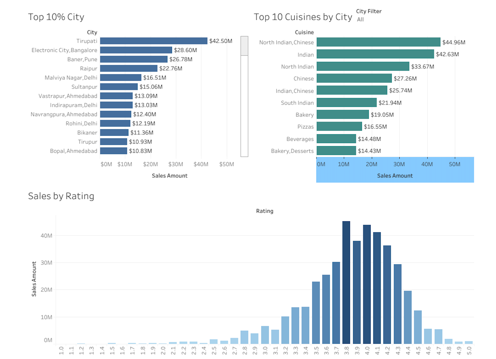
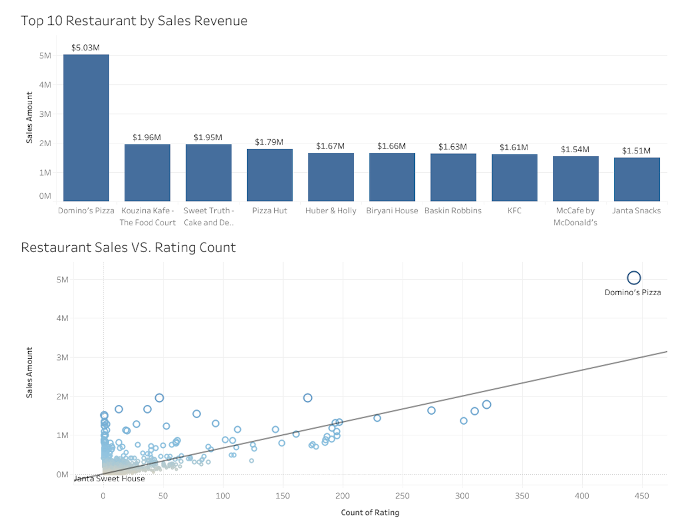

# Zomato Restaurant Analysis

## Table of Contents
<table>
  <tr>
    <td>#</td>
    <td>File Name</td>
    <td>Description</td>
  </tr>
  <tr>
    <td>1</td>
    <td><a href="https://github.com/bobacapybara/Data_projects_TripleTen/blob/main/Zomato%20Restaurant%20Analysis/Dashboard1.png">Dashboard1.png</a></td>
    <td>The image of the Tableau dashboard showing sales of cities</td>
  </tr>
  <tr>
    <td>2</td>
    <td><a href="https://github.com/bobacapybara/Data_projects_TripleTen/blob/main/Zomato%20Restaurant%20Analysis/Dashboard2.png">Dashboard2.png</a></td>
    <td>The image of the Tableau dashboard showing sales of restaurants.</td>
  </tr>
  <tr>
    <td>3</td>
    <td><a 
herf="https://github.com/bobacapybara/Data_projects_TripleTen/blob/main/Zomato%20Restaurant%20Analysis/README.md">Readme.md</a></td>
     <td> This is the readme file.</td>
  </tr>
  <tr>
    <td>4</td>
    <td><a   
herf="https://github.com/bobacapybara/Data_projects_TripleTen/blob/main/Zomato%20Restaurant%20Analysis/Zomato%20Restaurant%20Analysis%20Plan.pdf">Zomato Restaurant Analysis Plan</a></td>
   <td> This is the Zomato Restaurant Analysis Plan.</td> 
  </tr>
  <tr>
    <td>5</td>
    <td><a 
  herf="https://github.com/bobacapybara/Data_projects_TripleTen/blob/main/Zomato%20Restaurant%20Analysis/Zomato%20Restaurant%20Analysis%20Summary.pdf">Zomato Restaurant Analysis Summary</a></td>
    <td> This is the Zomato Restaurant Analysis Summary.</td> 
  </tr>
</table>

## 📊 Project Description

This Tableau project analyzes restaurant and sales data from Zomato with the goal of uncovering the key drivers behind restaurant performance and providing actionable insights for business growth. The analysis focuses on:

- **Which restaurants drive the most revenue and why?**
- **What traits (e.g., cuisine, location) correlate with high performance?**
- **How do ratings influence order volume and consumer behavior?**
- **Are there geographic or cuisine-based trends among top performers?**

Through interactive dashboards and visual exploration, the project identifies high-performing restaurants, evaluates the impact of location and cuisine on sales, and assesses how ratings and review volume shape consumer trust and spending. The insights are intended to inform marketing, investment, and operational strategies for food businesses on the platform.

#### 📈 Tools Used
- Tableau (for visualization and dashboard development)
- Zomato Dataset (restaurant-level sales and rating data)
---

## 🔍 Analysis

#### 1. Top Cities by Sales
- **Tirupati** emerges as the leader in total revenue.
- Strong performance is also observed in parts of **Bangalore**, **Pune**, and **Raipur**.
- Cities like **Delhi** and **Ahmedabad** feature multiple high-revenue localities.

#### 2. Top Cuisines
- **North Indian** and **Chinese** cuisines (individually and combined) are the top revenue generators.
- Other high-demand categories include **Bakery**, **Pizza**, **Beverages**, and **Desserts**.

#### 3. Sales by Rating
- Restaurants with ratings between **3.8 and 4.2** generate the highest revenue.
- Surprisingly, **very high ratings** (>4.5) do not always equate to more sales.
- **Low-rated restaurants** (<3.0) consistently show low sales performance.

#### 4. Sales vs. Rating Count
- A **positive correlation** exists between the number of ratings and total sales.
- **Domino’s Pizza** stands out as a leader in both rating volume and sales.
- A few **smaller or niche restaurants** outperform expectations despite fewer ratings.

  

---

## ✅ Conclusions

- Sales concentration is not evenly distributed—certain cities and neighborhoods dominate.
- Cuisine type is a major driver of customer behavior, with predictable and comfort-based categories leading.
- Ratings influence sales, but **volume of ratings** (credibility and social proof) plays a more critical role than just high scores.
- **Mid-tier rated restaurants** (3.8–4.2) offer a sweet spot for profitability.

---

## 💡 Recommendations

- **Invest in high-performing cities and neighborhoods** to maximize ROI.
- **Promote top-selling cuisines**, and explore innovative combinations or combo menus.
- **Incentivize customer reviews** to boost visibility and perceived trustworthiness.
- Focus support on **mid-to-high rated restaurants (3.8–4.2)**, which yield optimal returns.
- Identify and **nurture under-the-radar performers** that show potential for strategic growth.

#### 🚀 Next Steps

- Launch **targeted marketing campaigns** in high-revenue cities.
- Pilot **multi-cuisine kitchen models** in emerging mid-tier markets.
- Set up a **quarterly review cycle** to track shifts in performance and update strategy accordingly.

---

